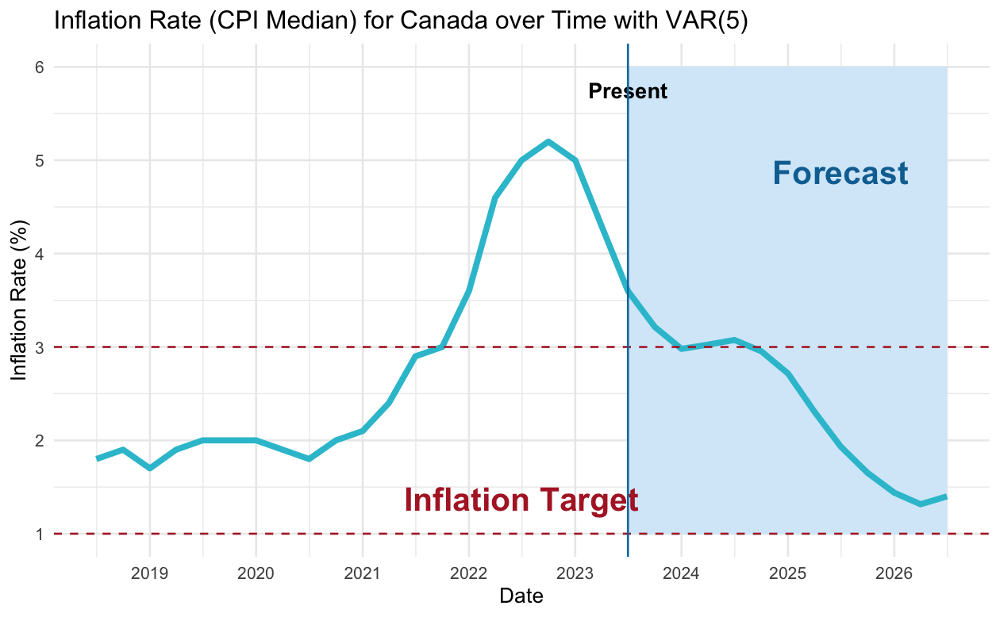
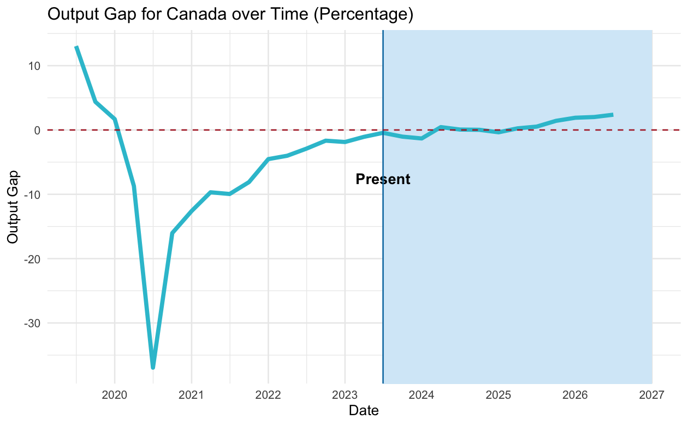
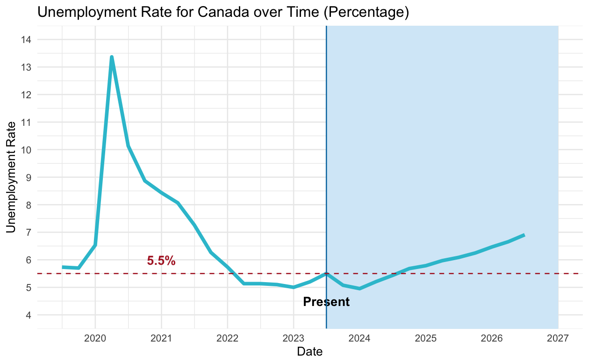
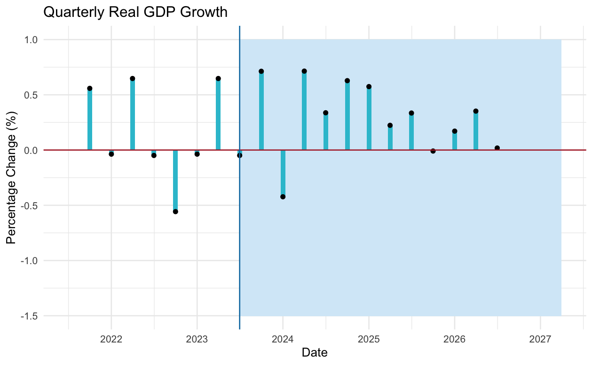
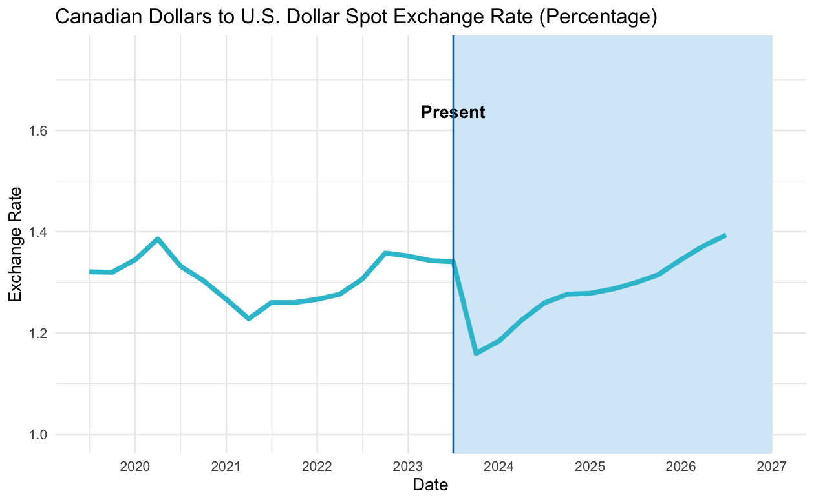
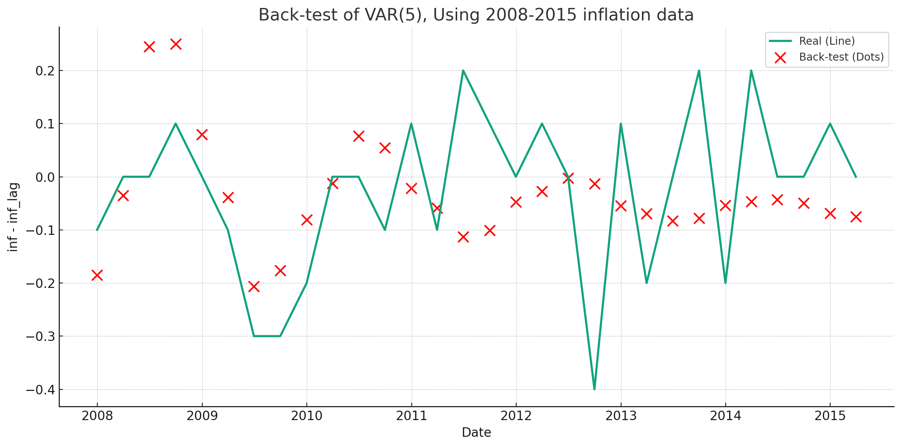
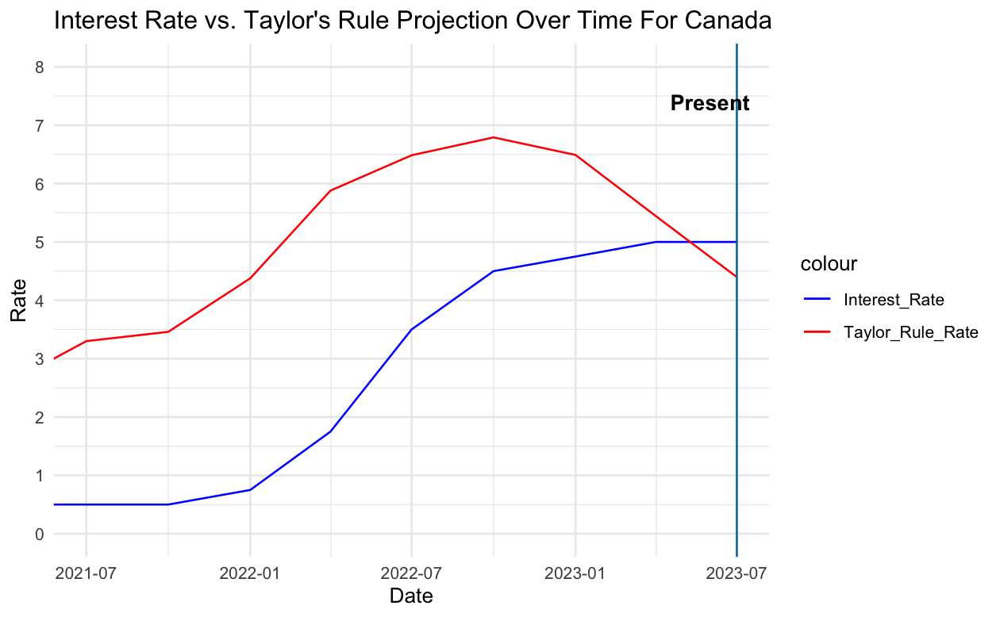

# Bank of Canada Governor's Challenge: Forecasting Part

## Authors
**Dewei Lin**  
*University of Toronto, Scarborough*

## Main Contents
This project involves two major models:
- The Time Series for future Canadian economics
- Taylor's Rule for current Canadian economics

## Data Collection
The following data were collected:

- **Real Gross Domestic Product**: Quarterly, Not Seasonally Adjusted  
  *Source: FRED*

- **Output Gap**: Annually  
  *Source: Nasdaq Data Link*

- **CPI Median (core)**: Monthly  
  CPI-median is a measure of core inflation corresponding to the price change located at the 50th percentile of the distribution of price changes in a given month. This helps filter out extreme price movements.  
  *Source: BOC*

- **Unemployment Rate**: Quarterly, Seasonally Adjusted  
  *Source: FRED*

- **CAD to US Dollars**: Monthly  
  *Source: FRED*

- **Labor and Capital Productivity**: Quarterly, Not Seasonally Adjusted  
  *Source: Statistics Canada*

## Data Processing
- **(a)** The data are in different scales; monthly data are averaged to calculate quarterly data, particularly for exchange rates and CPI Median.
  
- **(b)** The output gap is in annual scale. The Cobb-Douglas model is used to model quarterly output gap and potential output with annual data.  
  Potential Output: \( \bar{Y} = AK^{\alpha}L^{1-\alpha} \)

## Time-Series Forecasting

### Pre-Modelling
- VAR and B-VAR models are used.
- Key indicators: Real GDP, inflation rate, interest rate, exchange rate (CAD to USD), unemployment rate, output gap.
- All indicators are differenced to satisfy the VAR assumption of stationarity.

### Model Selection
- AIC criteria are used to select the best-fit model and lag values based on the real-time data.
- BVAR was found to be unstable; **VAR(5)** is the best model according to AIC.

### Results

#### Inflation

#### Output Gap

#### Unemployment Rate

#### Real GDP Growth

#### Exchange Rate

### Model Diagnosis
- A back-test was performed to evaluate model validity.  
  

- The unit root test confirms that our model is safe from non-stationarity.

## Taylor's Rule

### Specification of Taylor's Rule
The ordinary Taylor's Rule is specified as follows:
\[ 
i = r^* + \pi + 0.5(y - y^*) + 0.5(\pi - \pi^*) 
\]
Where:
- \( i \) is the nominal interest rate.
- \( r^* \) is the neutral real interest rate.
- \( \pi \) is the rate of inflation.
- \( y - y^* \) is the output gap.
- \( \pi^* \) is the target inflation rate, which is 2.

### Result

---

**Note:** This README serves as a summary of the forecasting project. For detailed analysis and results, please refer to the accompanying files.
